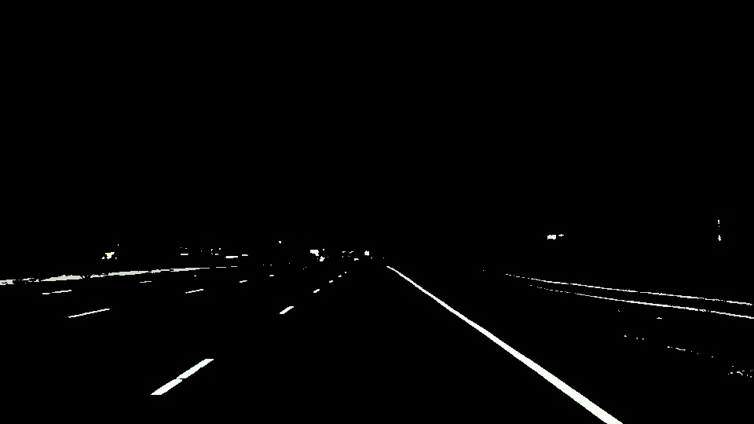
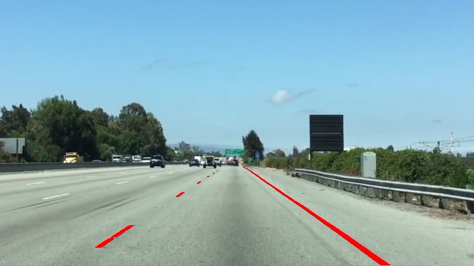
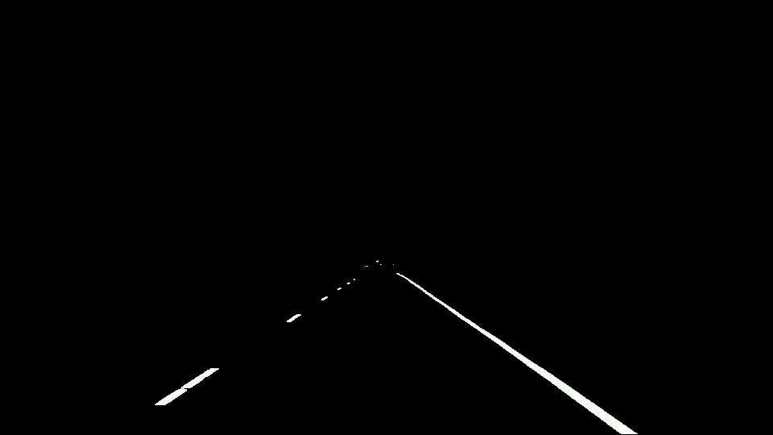

## Autonomous car lane detection

### Overview

Self-driving car needs percieve the world as humans do when they drive. 
Humans use their eyes to figure out how fast they go, where the lane lines are and where are the turns. Car does not have eyes but
self-driving cars can use cameras and other sensors to keep the similar function. So what does cameras are seeing as we drive down
the road is not the same as what we perceive. We have to teach the car how to percieve lane lines and turns.
So in this project I have written code to identify and track the position of the lane lines in the series of images using image
analysis techniques.  
  
  
  
Features of images to detect lane lines are:
  * color
  * shape
  * orientation
  * position of the image
  
  
### Setup
  
Language level and libraries used:
  * Python 3
  * Numpy
  * Matplotlib
  
  
### Run
Execute the following command from the root directory:

  ```
    python3 main.py 
  ```
  
  
### Results

Image after color detection



Image after color and Region detection



Image after mixing color and region selection images:


