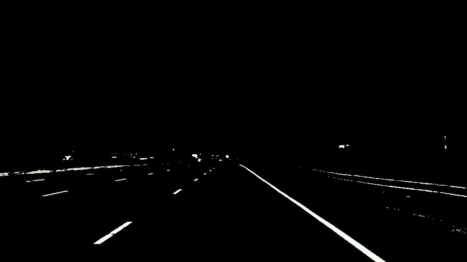

## Autonomous car lane detection

### Project Overview

Self-driving car needs percieve the world as humans do when they drive.
Humans use their eyes to figure out how fast they go, where the lane lines are and where are the turns. Car does not have eyes but
self-driving cars can use cameras and other sensors to keep the similar function. So what does cameras are seeing as we drive down
the road is not the same as what we perceive. We have to teach the car how to percieve lane lines and turns.

So in this project I have written code to identify and track the position of the lane lines in the series of images using image
analysis techniques.

  

Features of images to detect lane lines are:
  * color
  * shape
  * orientation
  * position of the image


### Setup

Language level and libraries used:
  * Python 3
  * Numpy
  * Matplotlib


### Run
Execute the following command from the root directory:

  ```
    python3 main.py
  ```


### Results

Image after color detection



Image after color and Region detection


Image after mixing color and region selection images:


As it happens, lane lines are not always the same color, and even lines of the same color under different lighting conditions (day, night, etc) may fail to be detected by our simple color selection. What we need is to take our algorithm to the next level to detect lines of any color using sophisticated computer vision methods.

One way is using **Canny** function and fiddle with the parameters for the Gaussian smoothing and Edge Detection to optimize for detecting the lane lines well without detecting a lot of other stuff.


Now that we have all the edges it is time to compute the lane lines by using **Hough Transform** methodology and then only select lines which fell into our lane lines region.


